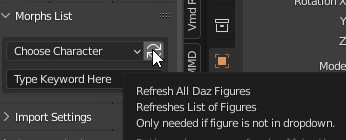
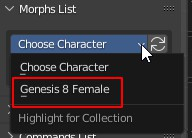
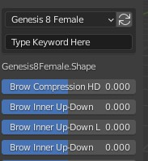

# Daz To Blender 3.0 fixed version

**This fork did some really good updates, it comes with 14 new features and 3 bug fixing, give it a try.**  

**It will export Daz model from Blender with all textures correctly. Then, you can use Blender as a Daz Bridge for all 3D tools. So you do not need any other bridge any more.**    

#### Version
2.23.7

## Updated Feature:
### Daz Script
* **Handle high heel.** (If you use this script, you don't need to check "High Heel" in Blender's addon when importing a character.)  

### Blender Addon
#### New Feature
* **Handle High heel when importing figure or a pose file**
* **Importing Pose by selecting Tip Image file**
* **Importing animation from .duf file**, animation will be on a new NLA tracker as a clip
* **Merge eyelashes into body mesh**, so you can export morphs from blender to other 3D tools.
* **Re-write material function, now it converts Daz's shader to Principled BSDF shader. So you can export all textures from blender.**
* **Convert Bump to Normal Map when importing, if you want**
* **Set position and rotation for env props like lights.**

### AO Map
For game engine, AO map is still important. But Daz Character is using UDIM UV, it is a tiled UV, which blender can not bake AO for that. So, I baked it for you with python script, you can get it from "AO" folder of this project.   

This AO can be used on all Genesis 8 characters, no matter how they look.  

#### New options for importing:  
  - Use Principled shader: Uncheck to use iray shader
  - **High Heel: check to ignore feet rotation for high heel, also works when importing pose.**
  - Rotation Limit: Uncheck to turn off(mute) rotation limit after importing. 
  - **Keep Limit on Twist Bone:** check to keep twist bone's rotation limit, but turn off other bones' limit
  - Custom Shape: Check to use custom shapes for bones
  - Use Drivers: Check to use drivers for morphs(shape keys on mesh). There are some bugs in those drivers expressions, it's your choice. 
  - **Clear Morph on Clothes**: it clears morphs on all wearable objects. So you won't have something like facial morphs on clothes.
  - **Convert Bump to Normal**: It is slow, but you only need to do it once if bump map is not changed.
  - Reuse Normal: reuse normal map files, so you do not have to re-converted it.
  - **SSS Rate:** Rate between Principled Subsurface and Daz's Translucency Weight

#### Bug fixed
* Fixed issues by blender 3.0 break change  
* Fixed a big issue when importing pose. Now you can import poses without problem
* Fixed node arranging function for Principled shader
* Fix high heel issues on both Blender and Daz sides.

## Notice
### You Need to Refresh Daz Model List after re-open your scene
When you want to apply pose, animation or use shape key drivers. This addon need to know which Daz model you want to apply with.  

**It is not based on which armature you select. It is based on which Daz model you choose on this addon's panel. There is a Daz model list on the panel.**  

When you re-open your scene, you need to click the refresh button on addon panel, it will scan all Daz model in the scene.  
  

Now you have a list of Daz models in this scene.  
  

Choose the one you want to use. Then shape key drivers will show up, also you can apply pose or animation to it now.  
  

This is how this official bridge works, I just leave it that way.  

### EyeClosed shape key
Be noticed, EyeClosed shape key is not a real shape key, it is a driver of EyeClosedL and EyeClosedR. If you don't use drivers, EyeClosed shape key won't work, you need to set EyeClosedL and EyeClosedR directly.  

### Subsurface
Blender will add a very strong blur to subsurface material, which will make you can not see your model clearly.  
So it is converted in this way:  
`Blender's Subsurface = Translucency Weight * SSS_Rate` (SSS_Rate's default value is 0.1)  
Then you can see your model more clearly. You can alwasy change SSS Rate on the Panel as you wish  

### Convert Bump Map to Normal Map
This process is purely done in blender without installing any third party package. So it is slow.  

But, you can reuse it if bump file is not changed, so you only need to do it once.  

This converted normal map file will be save to:`/bump_file_path/bump_file_name_normal.ext`, ext will be same as bump file.  

---
* Owner: [Daz 3D][OwnerURL] – [@Daz3d][TwitterURL]
* License: [Apache License, Version 2.0][LicenseURL] - see ``LICENSE`` and ``NOTICE`` for more information.
* Offical Release: [Daz to Blender Bridge][ProductURL]
* Official Project: [github.com/daz3d/DazToBlender][RepositoryURL]

## Prerequisites
---
* A compatible version of the [Daz Studio][DazStudioURL] application
  * Minimum: 4.10
* A compatible version of the [Blender][BlenderURL] application
  * Minimum: 2.80
* Operating System:
  * Windows 7 or newer
  * macOS 10.13 (High Sierra) or newer

## Maunal Installation
---
* Find the Newest Release [Here][ReleasesURL]
 ### How to download a new release from GitHub
 ---
 1. Go to the link listed above to find the newest release on GitHub.
 2. Under Assets you will find the newest build. It will be named DazToBlender_VersionNumber
 3. Download the zip and Inside you will find the Contents needed to use the bridge. Follow the steps below on how to install the bridge.  

 ## How to Install to Blender
 ---
  Within the "\Blender" folder, there will be a folder and a zip folder.
  1. To install the Bridge as a zip.
     1. Launch Blender.
     2. Go Edit -> Preferences -> Add-ons.
     3. Press Install at the Top-Right of the Preferences Window. 
     4. Locate your Zip File labeled "DTB.zip" and press Install Add-on
  2. To install the Bridge as a folder.
     1. Go to your AppData Folder. Easiest Method is to press start and type %appdata%
     2. Go to Appdata --> Roaming --> Blender Foundation --> Blender 
     3. Choose the version you wish to Install to For example 2.92
     4. Go to ...\Blender\2.92\scripts\addons\ and Copy the DTB folder to this location.

  ### How to Install to Daz Studio
  ---
   There are three different methods to install the Daz Side of the Bridge and we will go through all three of them.
   1. Installing the Bridge with the RunOnce Script.
      Please follow these steps to manually install the Daz to Blender bridge:
      
      **Note this is not necessary if you have installed by Daz Central/Daz Install Manager**
      1. Go to your AppData Folder. Easiest Method is to press start and type %appdata%
      2. Navigate within the Roaming folder to  --> DAZ 3D --> Studio4 → RunOnce
      3. Locate the Daz to Blender.dsa script with "\Use this to Install Daz Side"
      4. Drag and drop this script to the RunOnce folder and close out of this window
      5. Go to your install location of Daz Studio. By Default that location will be 
     
        *(WIN) C:\Program Files\DAZ 3D\DAZStudio4*
        
      6. Go to the location the Bridge Scripts are kept which is \scripts\support\DAZ\
      7. Inside of the Build Downloaded you will find the needed files under \Daz Studio\
      8. Drag and drop this script to the scripts location and close out of this window
      9. Run Daz Studio to finish the installation
   2. Replacing version from Daz Install Manager/Daz Central. 
      1. Go to your install location of Daz Studio. By Default that location will be 
      
          *(WIN) C:\Program Files\DAZ 3D\DAZStudio4*
          
      2. Go to the location of the Original Installation which will be: \scripts\support\DAZ\
      3. Inside of the Build Downloaded you will find the needed files under \Daz Studio\
      4. Replace the old versions with the contents here.
   3. Manually adding a script to your Daz Studio.
      
      *Inprogress*

## Directory Structure
---
Files in this repository are organized into two distinct top-level directories - named after the applications that the files within them relate to. Within these directories are hierarchies of subdirectories that correspond to locations on the target machine. Portions of the hierarchy are consistent between the supported platforms and should be replicated exactly while others serve as placeholders for locations that vary depending on the platform of the target machine.

Placeholder directory names used in this repository are:

Name  | Windows  | macOS
------------- | ------------- | -------------
appdata_common  | Equivalent to the expanded form of the `%AppData%` environment variable.  Sub-hierarchy is common between 32-bit and 64-bit architectures. | Equivalent to the `~/Library/Application Support` directory.  Sub-hierarchy is common between 32-bit and 64-bit architectures.
appdir_common  | The directory containing the primary executable (.exe) for the target application.  Sub-hierarchy is common between 32-bit and 64-bit architectures.  | The directory containing the primary application bundle (.app) for the target application.  Sub-hierarchy is common between 32-bit and 64-bit architectures.
BLENDER_VERSION  | The directory named according to the version of the Blender application - see [Blender Documentation][BlenderDocsURL] - e.g., "2.80", "2.83", etc.  | Same on both platforms.

The directory structure is as follows:

- `Blender`:                  Files that pertain to the _Blender_ side of the bridge
  - `appdata_common`:         See table above
    - `Blender Foundation`:   Application data specific to the organization
**^ Note:** _this level of the hierarchy is not present on macOS_ **^**
      - `Blender`:            Application data specific to the application
        - `BLENDER_VERSION`:  See table above
          - `...`:            Remaining sub-hierarchy
- `Daz Studio`:               Files that pertain to the _Daz Studio_ side of the bridge
  - `appdir_common`:          See table above
    - `...`:                  Remaining sub-hierarchy

[OwnerURL]: https://www.daz3d.com
[TwitterURL]: https://twitter.com/Daz3d
[LicenseURL]: http://www.apache.org/licenses/LICENSE-2.0
[ProductURL]: https://www.daz3d.com/daz-to-blender-bridge
[RepositoryURL]: https://github.com/daz3d/DazToBlender/
[DazStudioURL]: https://www.daz3d.com/get_studio
[ReleasesURL]: https://github.com/daz3d/DazToBlender/releases
[BlenderURL]: https://www.blender.org/download
[BlenderDocsURL]: https://docs.blender.org/manual/en/latest/advanced/blender_directory_layout.html#platform-dependent-paths
